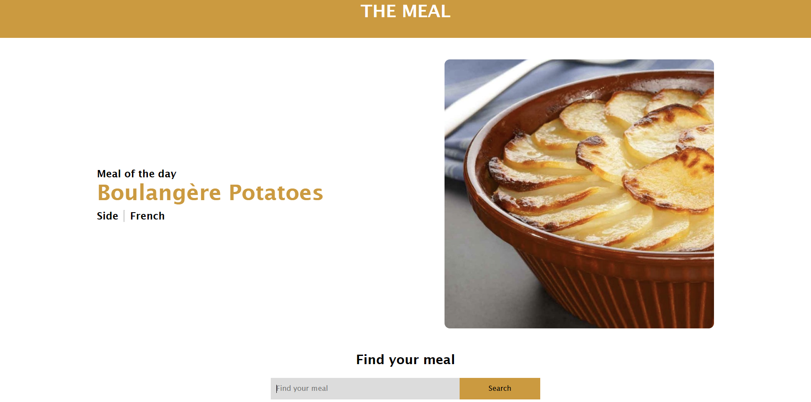
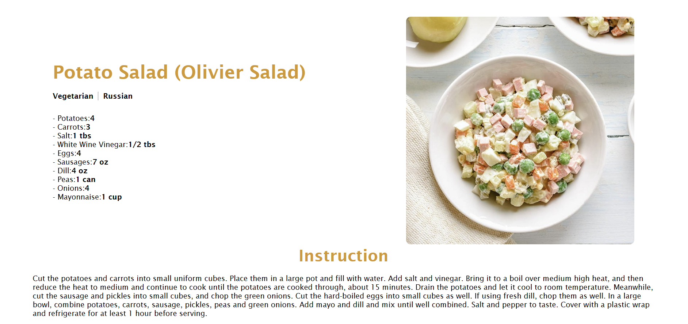

# React + Vite

Recipe search project

The main page displays a random recipe and a search field.

To search for a recipe, simply enter the name of the dish or ingredient in the field. A list of results will be returned.

For each result, you can go further and view detailed information, such as the ingredients and cooking instructions.

To install the application locally, you need to copy the SSH key. Clone the project.

Use the command npm clone <project key> to clone the project.

Use the command npm install to install all dependencies required for the project.

Start the project with the command npm run dev.

Deployed project link:

https://newobis-front-meal-react.vercel.app/details/53039
